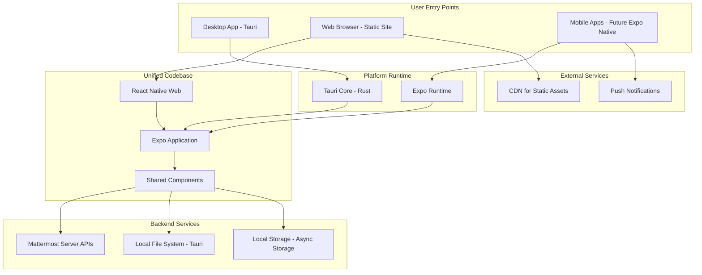
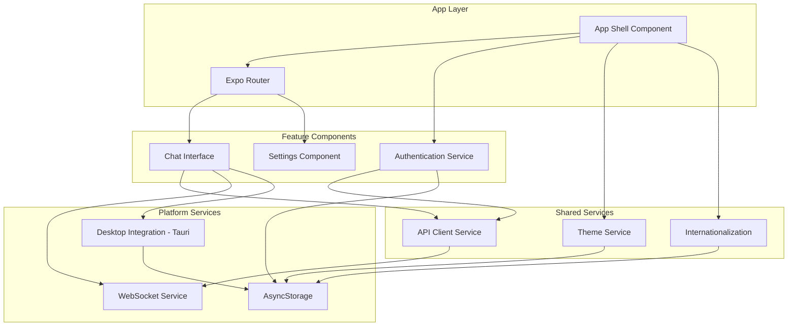
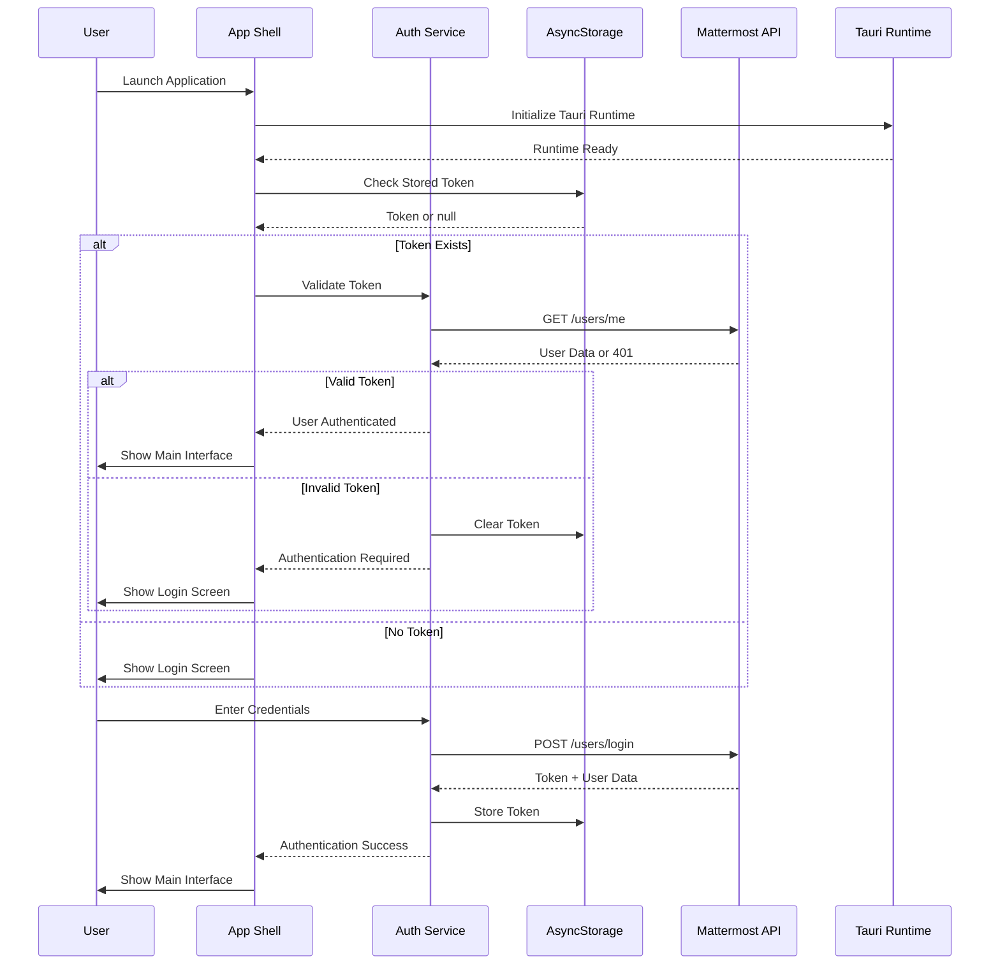
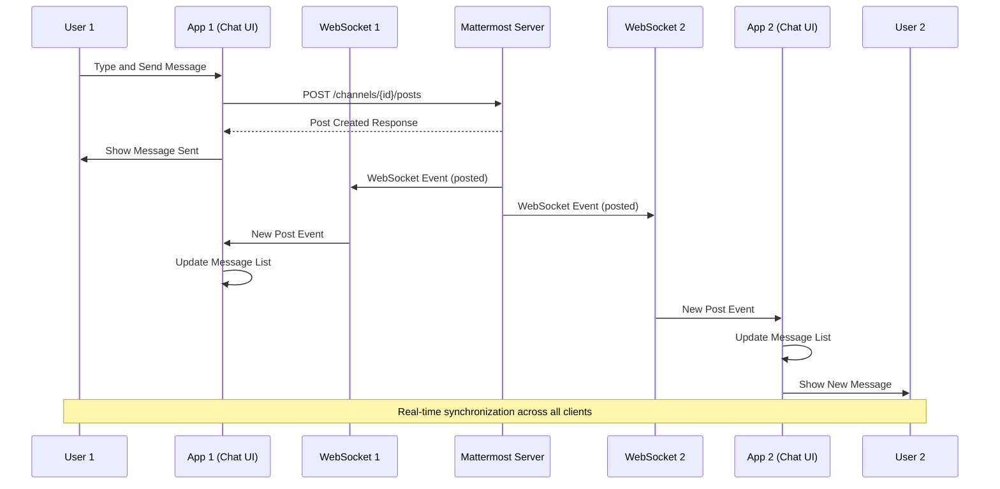
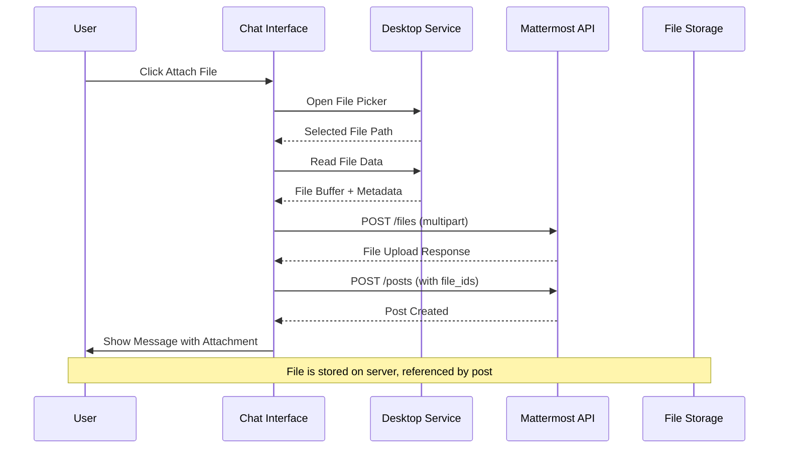
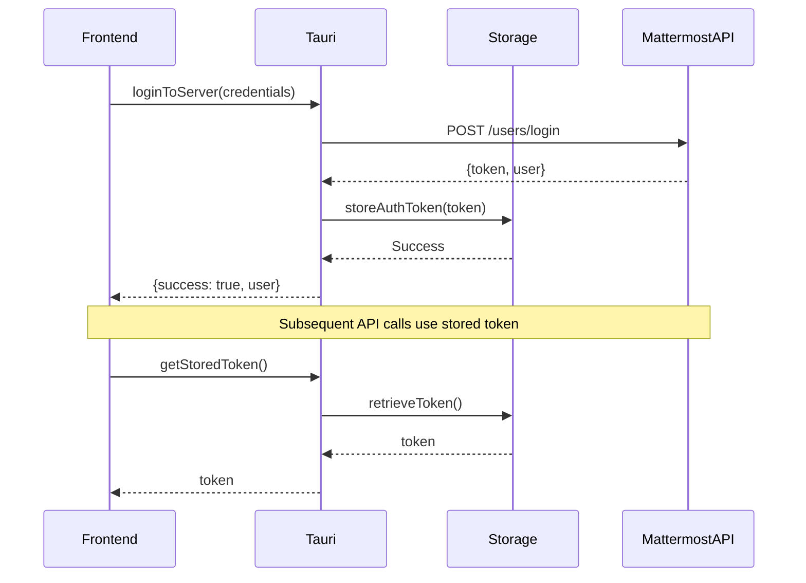
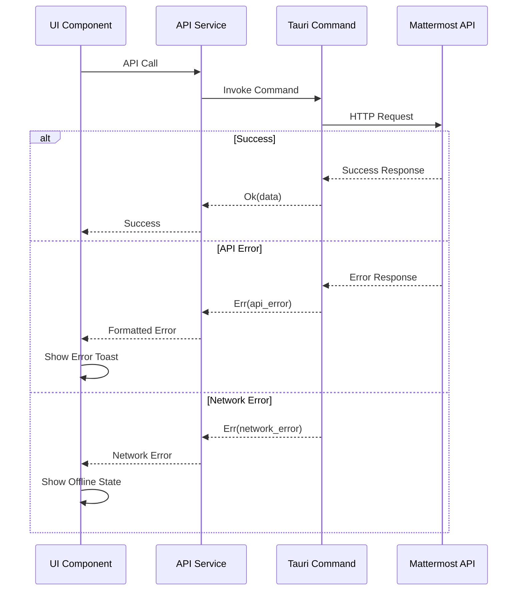

# Mattermost Platform Migration Architecture

## Introduction

This document serves as the central architecture reference for the Mattermost Platform Migration project, transitioning from Electron to Expo + Tauri. This is a **sharded architecture** - detailed implementation guidance is available in the linked documents below.

### Document Navigation

| Document                                                           | Purpose                                                          | Status      |
| ------------------------------------------------------------------ | ---------------------------------------------------------------- | ----------- |
| **[Coding Standards](./architecture/coding-standards.md)**         | Development patterns, TypeScript, React, and migration standards | ✅ Complete |
| **[Technology Stack](./architecture/tech-stack.md)**               | Comprehensive technology comparison and platform strategy        | ✅ Complete |
| **[Source Tree](./architecture/source-tree.md)**                   | Repository organization and file structure                       | ✅ Complete |
| **[API Design](./architecture/api-design.md)**                     | Tauri commands, external APIs, and integration patterns          | ✅ Complete |
| **[Security Model](./architecture/security-model.md)**             | Security architecture and migration from Node.js to Rust         | ✅ Complete |
| **[Testing Strategy](./architecture/testing-strategy.md)**         | Comprehensive testing approach with Jest and Storybook           | ✅ Complete |
| **[Performance Strategy](./architecture/performance-strategy.md)** | Optimization approaches and React Compiler integration           | 🔄 Future   |
| **[Deployment Strategy](./architecture/deployment-strategy.md)**   | Build pipeline and distribution strategy                         | 🔄 Future   |

### Context Documentation

| Document                                                 | Purpose                                            |
| -------------------------------------------------------- | -------------------------------------------------- |
| **[PRD](../prd.md)**                                     | Product Requirements Document with migration scope |
| **[Brownfield Analysis](../brownfield-architecture.md)** | Current state analysis and migration progress      |

## Architecture Overview

### High-Level System Design

```
┌─────────────────────────────────────────────────────────────────┐
│                    Legacy System (vendor/desktop)               │
│  ┌─────────────────┐ ┌─────────────────┐ ┌─────────────────┐    │
│  │   Electron      │ │    React 17     │ │      SCSS       │    │
│  │    38.2.1       │ │     + DOM       │ │   Webpack 5     │    │
│  └─────────────────┘ └─────────────────┘ └─────────────────┘    │
└─────────────────────────────────────────────────────────────────┘
                                │
                                ▼ MIGRATION
┌─────────────────────────────────────────────────────────────────┐
│                    Modern System (apps/v2)                      │
│  ┌─────────────────┐ ┌─────────────────┐ ┌─────────────────┐    │
│  │  Expo + Tauri   │ │    React 19     │ │   Unistyles     │    │
│  │ ~54.0.13+2.1.0  │ │  + RN + RNWeb   │ │   Metro Build   │    │
│  └─────────────────┘ └─────────────────┘ └─────────────────┘    │
└─────────────────────────────────────────────────────────────────┘
```

### Migration Status: **~40% Complete**

**✅ Foundation Complete** (Story 1.1, 1.3, 1.4):

- Project infrastructure established
- Theme system fully migrated (SCSS → Unistyles)
- Internationalization migrated (react-intl → i18next)
- Development environment configured

**🔄 Component Migration In Progress** (Stories 1.2, 1.3):

- React component conversion to component-per-folder structure
- Jest testing setup with React Native Testing Library integration
- Storybook 9 integration for component development and documentation
- SCSS to Unistyles StyleSheet conversion with co-located styles
- React 17 → 19 migration with React Compiler automatic memoization

**🔄 Backend Integration Pending**:

- Tauri command implementation
- Electron API → Rust API migration
- Desktop functionality integration

## Change Log

| Date       | Version | Description                                             | Author    |
| ---------- | ------- | ------------------------------------------------------- | --------- |
| 2025-10-19 | v4.0    | Sharded architecture documentation with migration focus | Architect |

## High Level Architecture

### Technical Summary

Skiffy Chat employs a hybrid cross-platform architecture using Expo as the unified development framework with Tauri providing desktop-specific capabilities. The React 19.1.0 frontend leverages react-native-web for static output generation, wrapped by Tauri 2.1.0 for desktop deployment, while maintaining the capability for future native mobile apps through standard Expo workflows. The Rust-based Tauri backend replaces Node.js Electron APIs for improved security and performance, while react-native-unistyles 3.0.15 provides cross-platform styling with C++ shadow tree updates for optimal rendering performance. React Compiler integration enables automatic performance optimization through build-time memoization, reducing manual optimization overhead while the i18next ecosystem supports 22 languages with expo-localization for platform-appropriate locale detection.

### Platform and Infrastructure Choice

**Platform:** Expo + Tauri Hybrid Architecture
**Key Services:** Expo Development Build, Tauri Runtime, React Native Web Static Output, pnpm Monorepo Tooling
**Deployment Host and Regions:**

- Desktop: Cross-platform native applications (Windows, macOS, Linux) via Tauri
- Web: Static hosting compatible (Vercel, Netlify, AWS S3/CloudFront)
- Future Mobile: App Store (iOS) and Google Play (Android) via Expo Application Services (EAS)

### Repository Structure

**Structure:** Monorepo with pnpm workspaces
**Monorepo Tool:** pnpm workspaces (native npm workspaces protocol)
**Package Organization:** Single app in apps/v2 with shared packages for future modularity

### High Level Architecture Diagram



### Architectural Patterns

- **Expo Cross-Platform Pattern:** Single React Native codebase with platform-specific optimizations - _Rationale:_ Maximizes code reuse while delivering platform-appropriate experiences
- **Static Site Generation with Desktop Wrapper:** Expo Web static output wrapped in Tauri container - _Rationale:_ Combines web deployment benefits with native desktop integration
- **Component-Based UI with TypeScript:** Reusable React components with strict TypeScript typing - _Rationale:_ Ensures type safety and maintainability across large codebase
- **Theme-Driven Styling:** Centralized Unistyles theme system with light/dark mode support - _Rationale:_ Consistent visual design with performant C++ rendering
- **Internationalization-First:** i18next with 22 language support and platform locale detection - _Rationale:_ Global accessibility with automatic user preference detection
- **Migration-Safe Architecture:** Preserve existing Mattermost API compatibility - _Rationale:_ Enables gradual migration without server-side changes
- **React Compiler Optimization:** Automatic memoization with selective manual optimization - _Rationale:_ Reduces manual optimization overhead while maintaining performance control where needed

## Tech Stack

### Technology Stack Table

| Category             | Technology                   | Version                                          | Purpose                                 | Rationale                                                                                |
| -------------------- | ---------------------------- | ------------------------------------------------ | --------------------------------------- | ---------------------------------------------------------------------------------------- |
| Frontend Language    | TypeScript                   | ~5.9.2                                           | Type-safe JavaScript development        | Strict typing prevents runtime errors, excellent tooling support                         |
| Frontend Framework   | React + Expo                 | React 19.1.0, Expo ~54.0.13                      | Cross-platform UI development           | Unified codebase for web, desktop, and future mobile with excellent developer experience |
| UI Component Library | React Native + Custom        | 0.81.4 + Custom Components                       | Cross-platform component primitives     | Native performance with web compatibility via react-native-web                           |
| State Management     | React Built-ins + Context    | React 19.1.0                                     | Component state and context             | React Compiler optimization makes built-ins sufficient for most use cases                |
| Backend Language     | Rust                         | Latest Stable (via Tauri)                        | System-level operations and security    | Memory safety, performance, and security advantages over Node.js                         |
| Backend Framework    | Tauri                        | 2.1.0                                            | Desktop application runtime             | Smaller bundle size and better security than Electron                                    |
| API Style            | REST + Direct Integration    | Mattermost Server APIs                           | Communication with Mattermost backend   | Maintain compatibility with existing server infrastructure                               |
| Database             | Local Storage + Server DB    | AsyncStorage + Mattermost DB                     | Local preferences and server data       | Client-side settings with server-side chat data                                          |
| Cache                | In-Memory + AsyncStorage     | React state + AsyncStorage                       | Performance optimization                | Fast access to frequently used data                                                      |
| File Storage         | Tauri Filesystem APIs        | @tauri-apps/plugin-fs                            | Local file operations                   | Secure file system access through Rust backend                                           |
| Authentication       | Mattermost Auth              | Server-based tokens                              | User authentication                     | Leverage existing Mattermost authentication system                                       |
| Frontend Testing     | Jest + React Testing Library | Jest-expo preset + @testing-library/react-native | Component and logic testing             | React 19 compatible testing with Unistyles/i18n integration (Story 1.2)                  |
| Backend Testing      | Rust testing framework       | Built-in cargo test                              | Tauri command testing                   | Native Rust testing capabilities                                                         |
| E2E Testing          | Playwright + Tauri           | Latest stable                                    | Full application testing                | Cross-platform e2e testing for desktop applications                                      |
| Build Tool           | pnpm                         | Latest stable                                    | Package management and builds           | Fast, reliable package management with workspace support                                 |
| Bundler              | Expo Metro                   | ~54.0.13                                         | JavaScript bundling                     | Optimized for React Native with web static output                                        |
| IaC Tool             | None                         | N/A                                              | Desktop app deployment                  | Desktop applications don't require infrastructure                                        |
| CI/CD                | GitHub Actions               | Latest                                           | Automated building and testing          | Cross-platform build automation                                                          |
| Monitoring           | Tauri logging + Custom       | Built-in                                         | Application monitoring                  | Custom telemetry for desktop application usage                                           |
| Logging              | Tauri console + File logging | Built-in                                         | Debug and error tracking                | Local logging with optional file persistence                                             |
| CSS Framework        | react-native-unistyles       | 3.0.15                                           | Cross-platform styling                  | TypeScript-first styling with C++ performance optimization                               |
| UI Development       | Storybook                    | 9.x                                              | Component development and documentation | React Native support for isolated component development (Story 1.3)                      |

## Data Models

### Core Data Models

Based on Mattermost domain requirements, the key entities are:

#### User

**Purpose:** Represents a user in the Mattermost system with authentication and profile information

**Key Attributes:**

- id: string - Unique identifier for the user
- username: string - User's login name
- email: string - User's email address
- firstName: string - User's first name
- lastName: string - User's last name
- nickname: string - User's display nickname
- position: string - User's job title or position
- locale: string - User's preferred language
- timezone: UserTimezone - User's timezone settings

##### TypeScript Interface

```typescript
interface User {
  id: string;
  username: string;
  email: string;
  first_name: string;
  last_name: string;
  nickname: string;
  position: string;
  locale: string;
  timezone: {
    useAutomaticTimezone: boolean;
    automaticTimezone: string;
    manualTimezone: string;
  };
  roles: string;
  notify_props: NotifyProps;
  last_password_update: number;
  last_picture_update: number;
  failed_attempts: number;
  mfa_active: boolean;
  terms_of_service_id: string;
  terms_of_service_create_at: number;
}
```

##### Relationships

- User belongs to multiple Teams
- User belongs to multiple Channels
- User creates Posts
- User receives Notifications

#### Team

**Purpose:** Represents a team workspace containing channels and members

**Key Attributes:**

- id: string - Unique identifier for the team
- name: string - Team's URL-friendly name
- displayName: string - Team's human-readable name
- description: string - Team description
- type: TeamType - Open or invite-only team
- allowOpenInvite: boolean - Whether team allows open invitations

##### TypeScript Interface

```typescript
interface Team {
  id: string;
  create_at: number;
  update_at: number;
  delete_at: number;
  display_name: string;
  name: string;
  description: string;
  email: string;
  type: "O" | "I"; // Open or Invite
  company_name: string;
  allowed_domains: string;
  invite_id: string;
  allow_open_invite: boolean;
  scheme_id: string;
  group_constrained: boolean;
  policy_id: string;
}
```

##### Relationships

- Team contains multiple Channels
- Team has multiple TeamMembers (Users)
- Team has TeamSettings

#### Channel

**Purpose:** Represents a communication channel within a team for organizing conversations

**Key Attributes:**

- id: string - Unique identifier for the channel
- teamId: string - ID of the team this channel belongs to
- type: ChannelType - Public, private, direct message, or group message
- displayName: string - Channel's display name
- name: string - Channel's URL-friendly name
- purpose: string - Channel's stated purpose
- header: string - Channel header text

##### TypeScript Interface

```typescript
interface Channel {
  id: string;
  create_at: number;
  update_at: number;
  delete_at: number;
  team_id: string;
  type: "O" | "P" | "D" | "G"; // Open, Private, Direct, Group
  display_name: string;
  name: string;
  header: string;
  purpose: string;
  last_post_at: number;
  total_msg_count: number;
  extra_update_at: number;
  creator_id: string;
  scheme_id: string;
  props: Record<string, any>;
  group_constrained: boolean;
  shared: boolean;
  total_msg_count_root: number;
  policy_id: string;
}
```

##### Relationships

- Channel belongs to one Team
- Channel contains multiple Posts
- Channel has multiple ChannelMembers (Users)
- Channel has ChannelSettings

#### Post

**Purpose:** Represents a message or post within a channel

**Key Attributes:**

- id: string - Unique identifier for the post
- channelId: string - ID of the channel this post belongs to
- userId: string - ID of the user who created the post
- message: string - The post content
- type: PostType - Regular post, system message, etc.
- rootId: string - ID of root post if this is a reply
- parentId: string - ID of immediate parent post

##### TypeScript Interface

```typescript
interface Post {
  id: string;
  create_at: number;
  update_at: number;
  edit_at: number;
  delete_at: number;
  is_pinned: boolean;
  user_id: string;
  channel_id: string;
  root_id: string;
  parent_id: string;
  original_id: string;
  message: string;
  type: string;
  props: Record<string, any>;
  hashtags: string;
  pending_post_id: string;
  reply_count: number;
  last_reply_at: number;
  participants: string[] | null;
  file_ids: string[];
  has_reactions: boolean;
  metadata: PostMetadata;
}
```

##### Relationships

- Post belongs to one Channel
- Post created by one User
- Post may reply to another Post (threading)
- Post may have FileAttachments
- Post may have Reactions

## Electron Migration Data Structures

### Overview

The migration from Electron (vendor/desktop) to Expo + Tauri requires careful mapping of existing data structures, configurations, and APIs. The analysis of the Electron codebase reveals several critical data structures that must be preserved during migration.

### Desktop Configuration Migration

#### Current Electron Config Structure (ConfigV4)

```typescript
// From: vendor/desktop/src/types/config.ts
interface ConfigV4 {
  version: 4;
  servers: ConfigServer[];
  showTrayIcon: boolean;
  trayIconTheme: string;
  minimizeToTray: boolean;
  notifications: {
    flashWindow: number;
    bounceIcon: boolean;
    bounceIconType: "" | "critical" | "informational";
  };
  showUnreadBadge: boolean;
  useSpellChecker: boolean;
  enableHardwareAcceleration: boolean;
  autostart: boolean;
  hideOnStart: boolean;
  spellCheckerLocales: string[];
  darkMode: boolean;
  downloadLocation?: string;
  spellCheckerURL?: string;
  lastActiveServer?: number;
  startInFullscreen?: boolean;
  autoCheckForUpdates?: boolean;
  alwaysMinimize?: boolean;
  alwaysClose?: boolean;
  logLevel?: string;
  appLanguage?: string;
  enableMetrics?: boolean;
  viewLimit?: number;
  themeSyncing?: boolean;
}

interface ConfigServer {
  name: string;
  url: string;
  order: number;
}
```

#### Migration Strategy to Tauri Configuration

**Target Tauri Config Structure:**

```typescript
// New Tauri-compatible configuration
interface TauriAppConfig {
  version: 5; // Increment version for migration tracking
  servers: TauriServer[];
  preferences: TauriPreferences;
  window: TauriWindowSettings;
  migration: {
    fromElectron: boolean;
    electronVersion: string;
    migrationDate: string;
  };
}

interface TauriServer {
  id: string; // Add UUID for better tracking
  name: string;
  url: string;
  order: number;
  isDefault: boolean;
  authType?: "basic" | "oauth" | "saml";
  lastAccessTime?: number;
  serverVersion?: string;
}

interface TauriPreferences {
  appearance: {
    theme: "light" | "dark" | "system";
    trayIconTheme: string;
    showTrayIcon: boolean;
    minimizeToTray: boolean;
  };
  notifications: {
    enabled: boolean;
    flashWindow: number;
    bounceIcon: boolean;
    bounceIconType: "" | "critical" | "informational";
    showUnreadBadge: boolean;
  };
  language: {
    appLanguage: string;
    spellChecker: {
      enabled: boolean;
      locales: string[];
      customURL?: string;
    };
  };
  performance: {
    enableHardwareAcceleration: boolean;
    enableMetrics: boolean;
    logLevel: "error" | "warn" | "info" | "debug" | "silly";
  };
  startup: {
    autostart: boolean;
    hideOnStart: boolean;
    startInFullscreen: boolean;
    lastActiveServer?: string; // Use server ID instead of index
  };
  updates: {
    autoCheckForUpdates: boolean;
  };
  download: {
    location?: string;
  };
  limits: {
    viewLimit?: number;
  };
}

interface TauriWindowSettings {
  bounds?: {
    x: number;
    y: number;
    width: number;
    height: number;
  };
  maximized: boolean;
  alwaysMinimize: boolean;
  alwaysClose: boolean;
}
```

### Desktop API Migration

#### Current Electron Desktop API

```typescript
// From: vendor/desktop/api-types/index.ts
interface DesktopAPI {
  // Initialization
  isDev: () => Promise<boolean>;
  getAppInfo: () => Promise<{ name: string; version: string }>;
  reactAppInitialized: () => void;

  // Session Management
  setSessionExpired: (isExpired: boolean) => void;
  onUserActivityUpdate: (
    listener: (
      userIsActive: boolean,
      idleTime: number,
      isSystemEvent: boolean,
    ) => void,
  ) => () => void;
  onLogin: () => void;
  onLogout: () => void;

  // Notifications
  sendNotification: (
    title: string,
    body: string,
    channelId: string,
    teamId: string,
    url: string,
    silent: boolean,
    soundName: string,
  ) => Promise<{ status: string; reason?: string; data?: string }>;
  onNotificationClicked: (
    listener: (channelId: string, teamId: string, url: string) => void,
  ) => () => void;
  setUnreadsAndMentions: (isUnread: boolean, mentionCount: number) => void;

  // Navigation & History
  requestBrowserHistoryStatus: () => Promise<{
    canGoBack: boolean;
    canGoForward: boolean;
  }>;
  onBrowserHistoryStatusUpdated: (
    listener: (canGoBack: boolean, canGoForward: boolean) => void,
  ) => () => void;
  sendBrowserHistoryPush: (path: string) => void;

  // Theme & Appearance
  updateTheme: (theme: Theme) => void;
  getDarkMode: () => Promise<boolean>;
  onDarkModeChanged: (listener: (darkMode: boolean) => void) => () => void;

  // Calls & Media
  joinCall: (
    opts: CallOptions,
  ) => Promise<{ callID: string; sessionID: string }>;
  leaveCall: () => void;
  getDesktopSources: (
    opts: DesktopSourcesOptions,
  ) => Promise<DesktopCaptureSource[]>;
  shareScreen: (sourceID: string, withAudio: boolean) => void;

  // Popouts & Windows
  canPopout: () => Promise<boolean>;
  openPopout: (path: string, props: PopoutViewProps) => Promise<string>;
  sendToParent: (channel: string, ...args: unknown[]) => void;
  sendToPopout: (id: string, channel: string, ...args: unknown[]) => void;
}
```

#### Target Tauri Command Structure

```rust
// Tauri backend commands to replace Electron APIs
use tauri::command;

#[command]
async fn get_app_info() -> Result<AppInfo, String> {
  // Implementation
}

#[command]
async fn send_notification(
  title: String,
  body: String,
  channel_id: String,
  team_id: String,
  url: String,
  silent: bool,
  sound_name: String
) -> Result<NotificationResult, String> {
  // Implementation
}

#[command]
async fn set_session_expired(expired: bool) -> Result<(), String> {
  // Implementation
}

#[command]
async fn update_theme(theme: Theme) -> Result<(), String> {
  // Implementation
}

#[command]
async fn get_desktop_sources(options: DesktopSourcesOptions) -> Result<Vec<DesktopCaptureSource>, String> {
  // Implementation
}

#[command]
async fn get_browser_history_status() -> Result<BrowserHistoryStatus, String> {
  // Implementation
}

#[command]
async fn open_popout(path: String, props: PopoutViewProps) -> Result<String, String> {
  // Implementation
}
```

### Theme System Migration

#### Current SCSS Variables → Unistyles Mapping

The existing theme system has been successfully migrated from SCSS to Unistyles as documented in `apps/v2/src/theme.ts`. The migration includes:

**Successfully Migrated (✅ Complete):**

- 50+ color variables from CSS to TypeScript theme objects
- Light theme (Denim) with comprehensive color palette
- Dark theme (Onyx) with matching dark mode variants
- Elevation shadows (6 levels)
- Border radius values (xs to full)
- Typography configuration (Open Sans, Metropolis, FontAwesome)
- Spacing utility function

**Migration Pattern Example:**

```scss
// Old SCSS (vendor/desktop/src/renderer/css/base/_css_variables.scss)
$primary-color: #166de0;
$primary-color-hover: #1458c8;
$sidebar-bg: #1e325c;
$sidebar-text: #ffffff;

// Migrated to Unistyles (apps/v2/src/theme.ts)
const lightTheme = {
  colors: {
    primary: "#166de0",
    primaryHover: "#1458c8",
    sidebarBg: "#1e325c",
    sidebarText: "#ffffff",
    // ... 50+ more colors
  }
};
```

### Internationalization Migration

#### Current react-intl → i18next Migration

**Successfully Migrated (✅ Complete):**

- 22 language files converted from react-intl format to i18next JSON
- TypeScript types for language keys and supported locales
- Expo localization integration for device locale detection
- AsyncStorage backend for persistence

**Migration Pattern Example:**

```tsx
// Old react-intl pattern (vendor/desktop)
import { FormattedMessage } from "react-intl";
<FormattedMessage id="label.save" defaultMessage="Save" />;

// New i18next pattern (apps/v2)
import { useTranslation } from "react-i18next";
const { t } = useTranslation();
<Text>{t("label.save")}</Text>;
```

### IPC Communication Migration

#### Electron IPC → Tauri Events

**Current Electron IPC Constants** (needs migration):

```typescript
// From: vendor/desktop/src/common/communication.ts
export const SWITCH_SERVER = "switch-server";
export const UPDATE_CONFIGURATION = "update-configuration";
export const DARK_MODE_CHANGE = "dark-mode-change";
export const NOTIFICATION_CLICKED = "notification-clicked";
export const UPDATE_MENTIONS = "update_mentions";
export const BROWSER_HISTORY_PUSH = "browser-history-push";
export const GET_DESKTOP_SOURCES = "get-desktop-sources";
export const CALLS_JOIN_CALL = "calls-join-call";
// ... 100+ more IPC constants
```

**Target Tauri Event System:**

```typescript
// New Tauri event patterns
import { invoke, listen } from "@tauri-apps/api/core";
import { emit } from "@tauri-apps/api/event";

// Command invocation (replaces ipcRenderer.invoke)
const appInfo = await invoke("get_app_info");

// Event listening (replaces ipcRenderer.on)
const unlisten = await listen("dark_mode_changed", (event) => {
  // Handle dark mode change
});

// Event emission (replaces ipcRenderer.send)
await emit("browser_history_push", { path: "/channel/general" });
```

### File System Path Migration

#### Current Electron Paths → Tauri Paths

```typescript
// Current Electron paths (vendor/desktop/src/main/constants.ts)
export let configPath = ""; // ${userDataPath}/config.json
export let allowedProtocolFile = ""; // ${userDataPath}/allowedProtocols.json
export let certificateStorePath = ""; // ${userDataPath}/certificate.json
export let boundsInfoPath = ""; // ${userDataPath}/bounds-info.json
export let downloadsJson = ""; // ${userDataPath}/downloads.json
export let permissionsJson = ""; // ${userDataPath}/permissions.json

// Target Tauri paths using @tauri-apps/api/path
import { appDataDir, configDir, downloadDir } from "@tauri-apps/api/path";

const paths = {
  config: await join(await appDataDir(), "config.json"),
  allowedProtocols: await join(await appDataDir(), "allowedProtocols.json"),
  certificates: await join(await appDataDir(), "certificates.json"),
  bounds: await join(await appDataDir(), "bounds.json"),
  downloads: await join(await appDataDir(), "downloads.json"),
  permissions: await join(await appDataDir(), "permissions.json"),
};
```

### Migration Priority Matrix

| Component               | Complexity | Migration Status | Priority |
| ----------------------- | ---------- | ---------------- | -------- |
| Theme System            | High       | ✅ Complete      | Complete |
| Internationalization    | High       | ✅ Complete      | Complete |
| Basic Project Structure | Medium     | ✅ Complete      | Complete |
| Configuration Migration | High       | 🔄 In Progress   | Critical |
| IPC → Tauri Commands    | High       | 🔄 Pending       | Critical |
| File System APIs        | Medium     | 🔄 Pending       | High     |
| Notification System     | Medium     | 🔄 Pending       | High     |
| Window Management       | Medium     | 🔄 Pending       | High     |
| Auto-updater            | High       | 🔄 Pending       | Medium   |
| Calls Integration       | High       | 🔄 Pending       | Medium   |
| Certificate Management  | Medium     | 🔄 Pending       | Low      |

## API Specification

### Mattermost Server API Integration

The application integrates with existing Mattermost Server APIs maintaining full compatibility with the current backend infrastructure. No server-side changes are required for the migration.

#### REST API Integration

```yaml
# Mattermost API Integration Specification
# Note: This documents client-side integration, not API definition

integration:
  title: Mattermost Server API Client Integration
  version: v4
  description: Client-side integration with Mattermost Server APIs

client_configuration:
  base_url: "configurable per server instance"
  api_version: "v4"
  authentication: "Bearer token based"

key_endpoints_used:
  authentication:
    - "POST /api/v4/users/login"
    - "POST /api/v4/users/logout"
    - "GET /api/v4/users/me"

  teams:
    - "GET /api/v4/users/me/teams"
    - "GET /api/v4/teams/{team_id}"
    - "GET /api/v4/teams/{team_id}/members"

  channels:
    - "GET /api/v4/teams/{team_id}/channels"
    - "GET /api/v4/channels/{channel_id}"
    - "GET /api/v4/channels/{channel_id}/posts"
    - "POST /api/v4/channels/{channel_id}/posts"

  websocket:
    - "WSS /api/v4/websocket"

migration_notes:
  - Replace Electron HTTP client with Tauri HTTP client
  - Maintain identical request/response handling
  - Preserve authentication token management
  - Keep WebSocket connection handling
```

## Components

### Component Architecture

The application follows a modular component architecture with clear separation between UI components, business logic, and platform-specific integrations.

#### App Shell Component

**Responsibility:** Main application container managing global state, routing, and platform initialization

**Key Interfaces:**

- InitializeApp() - Handles Tauri/Expo initialization
- ProvideGlobalContext() - Sets up theme, i18n, authentication context
- ManageRouting() - Handles navigation state

**Dependencies:** Theme system, i18n, authentication, routing

**Technology Stack:** React 19.1.0 with Expo Router 6.0.11, Unistyles theme provider, i18next provider

#### Authentication Service

**Responsibility:** Manages user authentication, token storage, and session handling

**Key Interfaces:**

- login(credentials) - Authenticates user with Mattermost server
- logout() - Clears session and redirects to login
- getCurrentUser() - Returns current authenticated user
- refreshToken() - Handles token refresh logic

**Dependencies:** AsyncStorage for token persistence, Mattermost API client

**Technology Stack:** React Context + hooks, AsyncStorage, Tauri secure storage

#### Chat Interface Component

**Responsibility:** Main chat interface with channel list, message view, and input

**Key Interfaces:**

- ChannelList - Displays team channels and direct messages
- MessageView - Renders post history with threading
- MessageInput - Handles message composition and sending

**Dependencies:** WebSocket service, post rendering, file upload

**Technology Stack:** React Native components with Unistyles, react-native-gesture-handler for interactions

#### Theme & Styling Service

**Responsibility:** Provides centralized theme management with light/dark mode support

**Key Interfaces:**

- ThemeProvider - Supplies theme context to all components
- useTheme() - Hook for accessing current theme
- toggleTheme() - Switches between light and dark modes

**Dependencies:** AsyncStorage for theme persistence, Unistyles configuration

**Technology Stack:** react-native-unistyles 3.0.15, React Context

#### Internationalization Service

**Responsibility:** Manages language detection, translation loading, and text rendering

**Key Interfaces:**

- i18nProvider - Provides translation context
- useTranslation() - Hook for accessing translations
- loadLanguage(locale) - Dynamically loads language pack

**Dependencies:** expo-localization, AsyncStorage for locale persistence

**Technology Stack:** i18next 25.6.0, react-i18next 16.1.0, expo-localization

#### Desktop Integration Service

**Responsibility:** Handles desktop-specific functionality through Tauri APIs

**Key Interfaces:**

- WindowManagement - Controls window state, notifications
- FileSystemAccess - Handles file operations and downloads
- SystemIntegration - Menu items, system tray, shortcuts

**Dependencies:** Tauri plugins, operating system APIs

**Technology Stack:** @tauri-apps/api 2.1.0, Tauri plugins for fs, notification, shell

### Component Diagrams



## External APIs

### Mattermost Server API

- **Purpose:** Complete team collaboration backend providing all chat functionality
- **Documentation:** https://api.mattermost.com/
- **Base URL(s):** Configurable per deployment (e.g., https://your-mattermost-server.com/api/v4)
- **Authentication:** Bearer token authentication with login/logout flows
- **Rate Limits:** Server-configured rate limiting (typically 10-100 requests/second)

**Key Endpoints Used:**

- `POST /api/v4/users/login` - User authentication
- `GET /api/v4/users/me/teams` - Get user's teams
- `GET /api/v4/teams/{team_id}/channels` - Get team channels
- `GET /api/v4/channels/{channel_id}/posts` - Get channel messages
- `POST /api/v4/channels/{channel_id}/posts` - Send new message
- `WSS /api/v4/websocket` - Real-time message updates

**Integration Notes:** The client maintains full compatibility with existing Mattermost server deployments, requiring no server-side changes. WebSocket connections handle real-time updates while REST APIs manage data operations.

## Core Workflows

### User Authentication and App Initialization



### Real-time Message Flow



### File Upload and Sharing



## Database Schema

### Local Storage Schema

The application uses AsyncStorage for local data persistence and relies on the Mattermost server for all chat data. Local storage contains user preferences, authentication tokens, and cached data for performance.

```typescript
// Local Storage Keys and Data Structures

interface LocalStorageSchema {
  // Authentication
  "auth.token": string | null;
  "auth.user": User | null;
  "auth.server_url": string | null;

  // User Preferences
  "preferences.theme": "light" | "dark";
  "preferences.language": ILanguage;
  "preferences.notifications": boolean;
  "preferences.sound_enabled": boolean;

  // App State
  "app.last_team_id": string | null;
  "app.last_channel_id": string | null;
  "app.window_bounds": WindowBounds | null;

  // Cache (TTL-based)
  "cache.teams": { data: Team[]; timestamp: number } | null;
  "cache.channels": {
    [teamId: string]: { data: Channel[]; timestamp: number };
  };
  "cache.users": { [userId: string]: { data: User; timestamp: number } };
}

interface WindowBounds {
  x: number;
  y: number;
  width: number;
  height: number;
  maximized: boolean;
}
```

### Server Database Integration

The application integrates with the existing Mattermost PostgreSQL database schema through REST APIs. No direct database access is required from the client application.

**Key Database Entities (Server-side):**

- Users table with authentication and profile data
- Teams table with team configuration and settings
- Channels table with channel metadata and permissions
- Posts table with message content and threading relationships
- ChannelMembers and TeamMembers for user associations
- Files table for attachment storage references

**Data Access Pattern:**
All database interactions occur through the Mattermost Server REST API, maintaining proper authorization and data consistency.

## Frontend Architecture

### Component Architecture

#### Component Organization (Component-Per-Folder Structure)

Based on Stories 1.2 and 1.3, each component is organized in its own folder with co-located files:

```
src/
├── components/                    # Component-per-folder structure
│   ├── common/                   # Generic components
│   │   ├── Button/               # Button component folder
│   │   │   ├── Button.tsx        # Main component
│   │   │   ├── styles.ts         # Co-located Unistyles
│   │   │   ├── Button.spec.tsx   # Jest tests
│   │   │   ├── Button.stories.tsx # Storybook stories
│   │   │   ├── types.ts          # Component types
│   │   │   └── index.ts          # Barrel export
│   │   ├── Input/                # Input component folder
│   │   │   ├── Input.tsx         # Main component
│   │   │   ├── styles.ts         # Co-located Unistyles
│   │   │   ├── InputLabel.tsx    # Sub-component
│   │   │   ├── InputError.tsx    # Sub-component
│   │   │   ├── Input.spec.tsx    # Jest tests with i18n/theme
│   │   │   ├── Input.stories.tsx # Storybook stories
│   │   │   └── index.ts          # Barrel export
│   │   └── Modal/                # Modal component folder
│   ├── chat/                     # Chat-specific components
│   │   ├── MessageList/          # Message list component folder
│   │   │   ├── MessageList.tsx   # Main component
│   │   │   ├── styles.ts         # Co-located Unistyles
│   │   │   ├── MessageItem.tsx   # Sub-component
│   │   │   ├── MessageList.spec.tsx # Component tests
│   │   │   ├── MessageList.stories.tsx # Storybook stories
│   │   │   └── index.ts          # Barrel export
│   │   ├── MessageInput/         # Message input component folder
│   │   └── ChannelList/          # Channel list component folder
│   ├── auth/                     # Authentication components
│   │   ├── LoginForm/            # Login form component folder
│   │   └── ServerInput/          # Server input component folder
│   └── settings/                 # Settings components
├── hooks/                        # Custom React hooks
├── services/                     # API and business logic
├── utils/                        # Utility functions with co-located tests
│   ├── formatters.ts             # Utility functions
│   ├── formatters.spec.ts        # Co-located unit tests
│   └── validators.spec.ts        # Co-located unit tests
├── __tests__/                    # Global tests (router, integration, e2e)
├── .rnstorybook/                 # Storybook configuration
├── contexts/                     # React contexts for global state
└── types/                        # TypeScript type definitions
```

#### Component Template

```typescript
import React from 'react';
import { View, Text } from 'react-native';
import { StyleSheet } from 'react-native-unistyles';
import { useTranslation } from 'react-i18next';

interface ComponentProps {
  title: string;
  onPress?: () => void;
  variant?: 'primary' | 'secondary';
}

export const Component: React.FC<ComponentProps> = ({
  title,
  onPress,
  variant = 'primary'
}) => {
  const { t } = useTranslation();

  return (
    <View style={styles.container(variant)}>
      <Text style={styles.title}>{title}</Text>
    </View>
  );
};

const styles = StyleSheet.create((theme) => ({
  container: (variant: string) => ({
    padding: theme.gap(2),
    borderRadius: theme.radius.m,
    backgroundColor: variant === 'primary'
      ? theme.colors.primary
      : theme.colors.secondary,
  }),
  title: {
    fontSize: 16,
    fontWeight: theme.fontWeights.semiBold,
    color: theme.colors.centerChannelColor,
  },
}));
```

### State Management Architecture

#### State Structure

```typescript
// Global Application State (React Context)
interface AppState {
  // Authentication state
  auth: {
    isAuthenticated: boolean;
    user: User | null;
    token: string | null;
    serverUrl: string | null;
  };

  // Chat state
  chat: {
    currentTeam: Team | null;
    currentChannel: Channel | null;
    teams: Team[];
    channels: { [teamId: string]: Channel[] };
    posts: { [channelId: string]: Post[] };
    unreadCounts: { [channelId: string]: number };
  };

  // UI state
  ui: {
    theme: "light" | "dark";
    language: ILanguage;
    sidebarOpen: boolean;
    notifications: boolean;
  };

  // Connection state
  connection: {
    online: boolean;
    websocketConnected: boolean;
    lastActivity: number;
  };
}
```

#### State Management Patterns

- **React Context + useReducer:** For complex state with multiple actions
- **useState:** For local component state
- **Custom hooks:** For reusable stateful logic
- **React Compiler optimization:** Automatic memoization reduces need for manual optimization

### Routing Architecture

#### Route Organization

```
app/                     # Expo Router file-based routing
├── +html.tsx           # HTML shell for web
├── _layout.tsx         # Root layout with providers
├── (auth)/             # Authentication routes
│   ├── _layout.tsx     # Auth layout
│   ├── login.tsx       # Login screen
│   └── server.tsx      # Server selection
├── (app)/              # Main application routes
│   ├── _layout.tsx     # App layout with sidebar
│   ├── index.tsx       # Team/channel selection
│   ├── [teamId]/       # Team-specific routes
│   │   ├── _layout.tsx # Team layout
│   │   ├── index.tsx   # Channel list
│   │   └── [channelId].tsx # Channel view
│   └── settings/       # Settings screens
└── +not-found.tsx      # 404 page
```

#### Protected Route Pattern

```typescript
import { Redirect } from 'expo-router';
import { useAuth } from '../hooks/useAuth';

export default function ProtectedLayout() {
  const { isAuthenticated, isLoading } = useAuth();

  if (isLoading) {
    return <LoadingScreen />;
  }

  if (!isAuthenticated) {
    return <Redirect href="/login" />;
  }

  return <Outlet />;
}
```

### Frontend Services Layer

#### API Client Setup

```typescript
import { fetch } from "@tauri-apps/plugin-http";

class MattermostApiClient {
  private baseUrl: string;
  private token: string | null = null;

  constructor(baseUrl: string) {
    this.baseUrl = baseUrl;
  }

  setToken(token: string) {
    this.token = token;
  }

  private async request<T>(
    endpoint: string,
    options: RequestInit = {},
  ): Promise<T> {
    const url = `${this.baseUrl}/api/v4${endpoint}`;

    const headers = {
      "Content-Type": "application/json",
      ...(this.token && { Authorization: `Bearer ${this.token}` }),
      ...options.headers,
    };

    const response = await fetch(url, {
      ...options,
      headers,
    });

    if (!response.ok) {
      throw new Error(`API Error: ${response.status}`);
    }

    return response.json();
  }

  // API methods
  async login(email: string, password: string) {
    return this.request<{ token: string; user: User }>("/users/login", {
      method: "POST",
      body: JSON.stringify({ login_id: email, password }),
    });
  }

  async getMe() {
    return this.request<User>("/users/me");
  }

  async getTeams() {
    return this.request<Team[]>("/users/me/teams");
  }

  // ... additional methods
}
```

#### Service Example

```typescript
import { useMutation, useQuery } from "@tanstack/react-query";
import { apiClient } from "./apiClient";

export const useAuth = () => {
  const loginMutation = useMutation({
    mutationFn: ({ email, password }: LoginCredentials) =>
      apiClient.login(email, password),
    onSuccess: (data) => {
      // Store token and user data
      AsyncStorage.setItem("auth.token", data.token);
      AsyncStorage.setItem("auth.user", JSON.stringify(data.user));
    },
  });

  const { data: user, isLoading } = useQuery({
    queryKey: ["user", "me"],
    queryFn: () => apiClient.getMe(),
    enabled: !!getStoredToken(),
  });

  return {
    login: loginMutation.mutate,
    isLoading: loginMutation.isLoading || isLoading,
    user,
    isAuthenticated: !!user,
  };
};
```

## Backend Architecture

### Service Architecture

The backend architecture leverages Tauri's Rust-based approach for system-level operations while maintaining compatibility with the existing Mattermost server infrastructure.

#### Tauri Command Architecture

```
src-tauri/
├── src/
│   ├── main.rs              # Application entry point
│   ├── commands/            # Tauri command handlers
│   │   ├── mod.rs           # Command module exports
│   │   ├── auth.rs          # Authentication commands
│   │   ├── files.rs         # File system operations
│   │   ├── notifications.rs # Desktop notifications
│   │   └── window.rs        # Window management
│   ├── services/            # Business logic services
│   │   ├── config.rs        # Configuration management
│   │   ├── storage.rs       # Local storage operations
│   │   └── utils.rs         # Utility functions
│   └── types/               # Rust type definitions
├── Cargo.toml               # Rust dependencies
└── tauri.conf.json          # Tauri configuration
```

#### Tauri Command Template

```rust
use tauri::command;
use serde::{Deserialize, Serialize};

#[derive(Debug, Deserialize)]
pub struct FileDownloadRequest {
    pub url: String,
    pub destination: String,
}

#[derive(Debug, Serialize)]
pub struct FileDownloadResponse {
    pub success: bool,
    pub path: String,
    pub error: Option<String>,
}

#[command]
pub async fn download_file(
    request: FileDownloadRequest,
) -> Result<FileDownloadResponse, String> {
    match download_file_impl(&request.url, &request.destination).await {
        Ok(path) => Ok(FileDownloadResponse {
            success: true,
            path,
            error: None,
        }),
        Err(e) => Ok(FileDownloadResponse {
            success: false,
            path: String::new(),
            error: Some(e.to_string()),
        }),
    }
}

async fn download_file_impl(url: &str, destination: &str) -> Result<String, Box<dyn std::error::Error>> {
    // Implementation details for file download
    // Using reqwest for HTTP client and tokio::fs for file operations
    todo!("Implement file download logic")
}
```

### Database Architecture

#### Local Configuration Storage

```rust
use serde::{Deserialize, Serialize};
use std::collections::HashMap;

#[derive(Debug, Serialize, Deserialize)]
pub struct AppConfig {
    pub servers: Vec<ServerConfig>,
    pub current_server: Option<String>,
    pub window_bounds: Option<WindowBounds>,
    pub theme: String,
    pub language: String,
    pub notifications_enabled: bool,
}

#[derive(Debug, Serialize, Deserialize)]
pub struct ServerConfig {
    pub id: String,
    pub name: String,
    pub url: String,
    pub token: Option<String>,
    pub last_team_id: Option<String>,
    pub last_channel_id: Option<String>,
}

impl AppConfig {
    pub fn load() -> Result<Self, ConfigError> {
        let config_path = get_config_path()?;
        let config_str = std::fs::read_to_string(config_path)?;
        let config: AppConfig = serde_json::from_str(&config_str)?;
        Ok(config)
    }

    pub fn save(&self) -> Result<(), ConfigError> {
        let config_path = get_config_path()?;
        let config_str = serde_json::to_string_pretty(self)?;
        std::fs::write(config_path, config_str)?;
        Ok(())
    }
}
```

#### Data Access Layer

```rust
use tauri::command;
use crate::services::storage::AppStorage;

#[command]
pub async fn get_server_config(server_id: String) -> Result<ServerConfig, String> {
    AppStorage::new()
        .get_server_config(&server_id)
        .map_err(|e| e.to_string())
}

#[command]
pub async fn save_server_config(config: ServerConfig) -> Result<(), String> {
    AppStorage::new()
        .save_server_config(config)
        .map_err(|e| e.to_string())
}

#[command]
pub async fn delete_server_config(server_id: String) -> Result<(), String> {
    AppStorage::new()
        .delete_server_config(&server_id)
        .map_err(|e| e.to_string())
}
```

### Authentication and Authorization

#### Auth Flow



#### Auth Middleware/Guards

```rust
use tauri::command;
use crate::services::auth::AuthService;

#[command]
pub async fn secure_operation(operation_data: String) -> Result<String, String> {
    let auth_service = AuthService::new();

    // Verify authentication
    match auth_service.get_current_token() {
        Some(token) => {
            if auth_service.validate_token(&token).await? {
                // Proceed with operation
                perform_secure_operation(operation_data).await
            } else {
                Err("Authentication token expired".to_string())
            }
        }
        None => Err("Authentication required".to_string()),
    }
}

async fn perform_secure_operation(data: String) -> Result<String, String> {
    // Actual operation implementation
    Ok(format!("Operation completed: {}", data))
}
```

## Unified Project Structure

```
skiffy-chat/
├── .github/                    # CI/CD workflows
│   └── workflows/
│       ├── ci.yaml            # Automated testing and linting
│       ├── build-desktop.yaml # Desktop app builds
│       └── build-web.yaml     # Web static builds
├── apps/                       # Application packages
│   └── v2/                     # New Expo + Tauri application
│       ├── src/
│       │   ├── components/     # React components
│       │   │   ├── common/     # Reusable UI components
│       │   │   ├── chat/       # Chat-specific components
│       │   │   ├── auth/       # Authentication components
│       │   │   └── settings/   # Settings components
│       │   ├── app/            # Expo Router pages
│       │   │   ├── (auth)/     # Authentication routes
│       │   │   ├── (app)/      # Main application routes
│       │   │   ├── _layout.tsx # Root layout
│       │   │   └── +html.tsx   # Web HTML shell
│       │   ├── hooks/          # Custom React hooks
│       │   ├── services/       # API clients and business logic
│       │   │   ├── api/        # Mattermost API integration
│       │   │   ├── websocket/  # Real-time communication
│       │   │   └── storage/    # Local storage utilities
│       │   ├── contexts/       # React contexts
│       │   ├── locales/        # i18next translation files
│       │   ├── utils/          # Utility functions
│       │   ├── types/          # TypeScript definitions
│       │   ├── theme.ts        # Unistyles theme configuration
│       │   ├── i18next.ts      # i18n configuration
│       │   └── index.ts        # Application entry point
│       ├── src-tauri/          # Tauri Rust backend
│       │   ├── src/
│       │   │   ├── commands/   # Tauri command handlers
│       │   │   ├── services/   # Rust business logic
│       │   │   ├── types/      # Rust type definitions
│       │   │   └── main.rs     # Rust application entry
│       │   ├── Cargo.toml      # Rust dependencies
│       │   └── tauri.conf.json # Tauri configuration
│       ├── public/             # Static web assets
│       ├── tests/              # Application tests
│       │   ├── components/     # Component tests
│       │   ├── integration/    # Integration tests
│       │   └── e2e/           # End-to-end tests
│       ├── expo.json           # Expo configuration
│       ├── app.config.js       # Dynamic Expo config
│       └── package.json        # App dependencies
├── packages/                   # Shared packages (future use)
│   ├── shared/                 # Shared types and utilities
│   │   ├── src/
│   │   │   ├── types/          # Shared TypeScript interfaces
│   │   │   ├── constants/      # Shared constants
│   │   │   └── utils/          # Shared utility functions
│   │   └── package.json
│   └── config/                 # Shared configuration
│       ├── eslint/             # ESLint configurations
│       ├── typescript/         # TypeScript configurations
│       └── prettier/           # Prettier configurations
├── vendor/                     # Legacy Electron application
│   └── desktop/                # Original Mattermost desktop app
├── docs/                       # Documentation
│   ├── prd.md                  # Product Requirements Document
│   ├── architecture.md         # This architecture document
│   ├── migration-guide.md      # Migration documentation
│   └── development-guide.md    # Development setup guide
├── scripts/                    # Build and deployment scripts
│   ├── build-all.sh           # Build all platforms
│   ├── test-all.sh            # Run all tests
│   └── migrate-data.js        # User data migration utility
├── .env.example                # Environment template
├── package.json                # Root package.json with workspaces
├── pnpm-workspace.yaml         # pnpm workspace configuration
├── tsconfig.json               # Root TypeScript configuration
├── .gitignore                  # Git ignore rules
└── README.md                   # Project documentation
```

## Development Workflow

### Local Development Setup

#### Prerequisites

```bash
# Required software
node --version    # >= 18.0.0
pnpm --version    # >= 8.0.0
rustc --version   # Latest stable Rust
cargo --version   # Latest stable Cargo

# Platform-specific requirements (for desktop builds)
# Windows: Microsoft C++ Build Tools
# macOS: Xcode Command Line Tools
# Linux: build-essential, libgtk-3-dev, libwebkit2gtk-4.0-dev
```

#### Initial Setup

```bash
# Clone repository
git clone <repository-url>
cd skiffy-chat

# Install dependencies for all workspaces
pnpm install

# Install Tauri CLI globally
pnpm add -g @tauri-apps/cli

# Set up development environment
cp .env.example .env.local
```

#### Development Commands

```bash
# Start all services for development
pnpm dev:desktop        # Expo + Tauri desktop development
pnpm dev:mobile         # Expo mobile development (for future use)

# Start individual services
pnpm --filter app start           # Expo development server only
pnpm --filter app tauri dev       # Tauri desktop development
pnpm --filter app web             # Web development

# Build commands
pnpm build:desktop      # Build desktop applications for all platforms
pnpm build:mobile       # Build Expo mobile export
pnpm build:web          # Build static web export

# Testing and linting
pnpm test              # Run all tests across workspaces
pnpm lint              # Run linting across workspaces
pnpm type-check        # TypeScript type checking
```

### Environment Configuration

#### Required Environment Variables

```bash
# Frontend (.env.local in apps/v2)
EXPO_PUBLIC_DEFAULT_SERVER_URL=https://your-mattermost-server.com
EXPO_PUBLIC_APP_VERSION=1.0.0
EXPO_PUBLIC_SENTRY_DSN=your-sentry-dsn

# Backend (Tauri configuration)
TAURI_IDENTIFIER=com.yourcompany.skiffychat
TAURI_BUNDLE_IDENTIFIER=com.yourcompany.skiffychat

# Development
NODE_ENV=development
EXPO_USE_FAST_RESOLVER=1
```

## Deployment Architecture

### Deployment Strategy

**Desktop Deployment:**

- **Platform:** Cross-platform native executables via Tauri
- **Build Command:** `pnpm build:desktop`
- **Output Directory:** `apps/v2/src-tauri/target/release/bundle/`
- **Distribution:** Direct download, auto-updater, or package managers

**Web Deployment:**

- **Platform:** Static hosting (Vercel, Netlify, AWS S3/CloudFront)
- **Build Command:** `pnpm build:web`
- **Output Directory:** `apps/v2/dist/`
- **CDN/Edge:** Automatic through static hosting platforms

**Future Mobile Deployment:**

- **Platform:** Expo Application Services (EAS) for iOS/Android
- **Build Command:** `eas build --platform all`
- **Distribution:** App Store and Google Play

### CI/CD Pipeline

```yaml
name: Build and Test
on: [push, pull_request]

jobs:
  test:
    runs-on: ubuntu-latest
    steps:
      - uses: actions/checkout@v4
      - uses: pnpm/action-setup@v2
        with:
          version: 8
      - uses: actions/setup-node@v4
        with:
          node-version: 18
          cache: "pnpm"

      - run: pnpm install
      - run: pnpm lint
      - run: pnpm type-check
      - run: pnpm test

  build-desktop:
    needs: test
    strategy:
      matrix:
        platform: [ubuntu-latest, windows-latest, macos-latest]
    runs-on: ${{ matrix.platform }}
    steps:
      - uses: actions/checkout@v4
      - uses: pnpm/action-setup@v2
      - uses: actions/setup-node@v4
        with:
          node-version: 18
          cache: "pnpm"
      - uses: dtolnay/rust-toolchain@stable

      - run: pnpm install
      - run: pnpm build:desktop

      - uses: actions/upload-artifact@v4
        with:
          name: desktop-${{ matrix.platform }}
          path: apps/v2/src-tauri/target/release/bundle/
```

### Environments

| Environment | Frontend URL                   | Backend URL         | Purpose                       |
| ----------- | ------------------------------ | ------------------- | ----------------------------- |
| Development | http://localhost:8081          | Tauri local runtime | Local development and testing |
| Staging     | https://staging.skiffychat.com | Configured server   | Pre-production testing and QA |
| Production  | https://skiffychat.com         | Configured server   | Live user environment         |

## Security and Performance

### Security Requirements

**Frontend Security:**

- CSP Headers: `default-src 'self'; script-src 'self' 'unsafe-inline'; style-src 'self' 'unsafe-inline'`
- XSS Prevention: React's built-in XSS protection + input sanitization
- Secure Storage: Tauri secure storage for authentication tokens

**Backend Security:**

- Input Validation: Rust's type system + serde validation for all Tauri commands
- Rate Limiting: Application-level rate limiting for API requests
- CORS Policy: Restrictive CORS configured for allowed origins only

**Authentication Security:**

- Token Storage: Secure system keychain via Tauri for authentication tokens
- Session Management: Automatic token refresh and secure logout
- Password Policy: Enforced by Mattermost server configuration

### Performance Optimization

**Frontend Performance:**

- Bundle Size Target: < 10MB total application size (improvement from Electron)
- Loading Strategy: Progressive loading with React Suspense and code splitting
- Caching Strategy: React Query for API response caching + AsyncStorage for offline data

**Backend Performance:**

- Response Time Target: < 100ms for local operations, network-dependent for server API calls
- Database Optimization: Efficient local storage access patterns with minimal disk I/O
- Caching Strategy: In-memory caching for frequently accessed configuration data

## Testing Strategy (Based on Stories 1.2 & 1.3)

### Testing Pyramid

```
        E2E Tests (Tauri + Playwright)
       /                              \
      Integration Tests (API + UI)
     /                                \
    Component Tests (Jest + RTL + Storybook)  Backend Unit (Cargo Test)
   /                                         \
  Unit Tests (Jest)                          Rust Tests (Cargo)
```

### Testing Framework Integration (Story 1.2)

**Jest Configuration**:

- jest-expo preset for Expo SDK mocking
- React Native Testing Library for React 19 compatibility
- react-native-unistyles/mocks for theme system testing
- Real i18next configuration (no stubbing) for authentic translation testing

**Component Test Structure**:

- Co-located `.spec.tsx` files for component tests
- Co-located `.spec.ts` files for utility tests
- Router tests in `__tests__/` directory (Expo Router requirement)
- Theme and i18n integration in all component tests

### Storybook Integration (Story 1.3)

**Component Documentation**:

- Co-located `.stories.tsx` files for component stories
- Environment-controlled access (`EXPO_PUBLIC_ENVIRONMENT='storybook'`)
- Integrated `/storybook` route within the app during development
- Component state variations and interactive documentation

### Test Organization

#### Frontend Tests

```
tests/
├── components/          # Component unit tests
│   ├── common/         # Generic component tests
│   ├── chat/           # Chat component tests
│   └── auth/           # Authentication component tests
├── hooks/              # Custom hook tests
├── services/           # Service layer tests
├── utils/              # Utility function tests
└── integration/        # Frontend integration tests
```

#### Backend Tests

```
src-tauri/src/
├── commands/
│   └── mod.rs          # Command integration tests
├── services/
│   └── mod.rs          # Service unit tests
└── lib.rs              # Library-level tests
```

#### E2E Tests

```
e2e/
├── fixtures/           # Test data and helpers
├── auth.spec.ts        # Authentication flow tests
├── chat.spec.ts        # Chat functionality tests
└── settings.spec.ts    # Settings and preferences tests
```

### Test Examples

#### Frontend Component Test

```typescript
import { render, screen, fireEvent } from '@testing-library/react-native';
import { MessageInput } from '../MessageInput';

describe('MessageInput', () => {
  it('should send message when submit button is pressed', async () => {
    const mockSendMessage = jest.fn();

    render(
      <MessageInput
        onSendMessage={mockSendMessage}
        placeholder="Type a message..."
      />
    );

    const input = screen.getByPlaceholderText('Type a message...');
    const sendButton = screen.getByRole('button', { name: 'Send' });

    fireEvent.changeText(input, 'Hello, world!');
    fireEvent.press(sendButton);

    expect(mockSendMessage).toHaveBeenCalledWith('Hello, world!');
  });
});
```

#### Backend API Test

```rust
#[cfg(test)]
mod tests {
    use super::*;
    use tempfile::tempdir;

    #[tokio::test]
    async fn test_save_server_config() {
        let temp_dir = tempdir().unwrap();
        let config_path = temp_dir.path().join("config.json");

        let config = ServerConfig {
            id: "test-server".to_string(),
            name: "Test Server".to_string(),
            url: "https://test.example.com".to_string(),
            token: None,
            last_team_id: None,
            last_channel_id: None,
        };

        let result = save_server_config_impl(&config_path, config.clone()).await;
        assert!(result.is_ok());

        let loaded_config = load_server_config_impl(&config_path).await.unwrap();
        assert_eq!(loaded_config.id, config.id);
        assert_eq!(loaded_config.url, config.url);
    }
}
```

#### E2E Test

```typescript
import { test, expect } from "@playwright/test";

test.describe("Authentication Flow", () => {
  test("should login successfully with valid credentials", async ({ page }) => {
    await page.goto("/");

    // Should redirect to login page
    await expect(page).toHaveURL("/login");

    // Fill in server URL
    await page.fill(
      '[data-testid="server-url"]',
      "https://demo.mattermost.com",
    );
    await page.click('[data-testid="next-button"]');

    // Fill in credentials
    await page.fill('[data-testid="email"]', "demo@mattermost.com");
    await page.fill('[data-testid="password"]', "demopassword");
    await page.click('[data-testid="login-button"]');

    // Should redirect to main app
    await expect(page).toHaveURL("/app");
    await expect(page.locator('[data-testid="team-sidebar"]')).toBeVisible();
  });
});
```

## Coding Standards

### Critical Fullstack Rules

- **Type Sharing:** Always define shared types in packages/shared when created, import from there for consistency
- **API Calls:** Never make direct HTTP calls in components - use the service layer and custom hooks
- **Environment Variables:** Access only through config objects, never process.env directly in production code
- **Error Handling:** All Tauri commands must use Result<T, String> and provide meaningful error messages
- **State Updates:** Never mutate state directly - use proper React state management patterns and immutable updates
- **Internationalization:** All user-facing text must use i18next translation keys, never hardcoded strings
- **Theme Usage:** Always use theme values from Unistyles, never hardcoded colors or spacing values
- **Platform Checks:** Use Expo/React Native platform detection, not user agent parsing or manual detection

### Naming Conventions

| Element          | Frontend                           | Backend              | Example                               |
| ---------------- | ---------------------------------- | -------------------- | ------------------------------------- |
| Components       | PascalCase                         | -                    | `UserProfile.tsx`                     |
| Hooks            | camelCase with 'use'               | -                    | `useAuth.ts`                          |
| API Services     | camelCase                          | snake_case           | `authService.ts` / `auth_service.rs`  |
| Tauri Commands   | camelCase (JS) / snake_case (Rust) | snake_case           | `getUserProfile` / `get_user_profile` |
| Types/Interfaces | PascalCase                         | PascalCase           | `User`, `ServerConfig`                |
| Constants        | SCREAMING_SNAKE_CASE               | SCREAMING_SNAKE_CASE | `API_BASE_URL`, `DEFAULT_TIMEOUT`     |

## Error Handling Strategy

### Error Flow



### Error Response Format

```typescript
interface ApiError {
  error: {
    code: string;
    message: string;
    details?: Record<string, any>;
    timestamp: string;
    requestId: string;
  };
}

// Example usage
const standardError: ApiError = {
  error: {
    code: "AUTH_FAILED",
    message: "Invalid username or password",
    details: { field: "password", attempts_remaining: 2 },
    timestamp: new Date().toISOString(),
    requestId: crypto.randomUUID(),
  },
};
```

### Frontend Error Handling

```typescript
import { useErrorBoundary } from "react-error-boundary";
import { toast } from "./toast";

export const useApiCall = <T>(apiFunction: () => Promise<T>) => {
  const { showBoundary } = useErrorBoundary();

  const execute = async () => {
    try {
      return await apiFunction();
    } catch (error) {
      if (error instanceof ApiError) {
        // Handle API errors with user-friendly messages
        toast.error(error.message);
      } else if (error instanceof NetworkError) {
        // Handle network errors
        toast.error(
          "Network connection failed. Please check your internet connection.",
        );
      } else {
        // Handle unexpected errors
        console.error("Unexpected error:", error);
        showBoundary(error);
      }
      throw error;
    }
  };

  return execute;
};
```

### Backend Error Handling

```rust
use serde::{Deserialize, Serialize};
use thiserror::Error;

#[derive(Error, Debug)]
pub enum AppError {
    #[error("Network error: {0}")]
    Network(#[from] reqwest::Error),

    #[error("Storage error: {0}")]
    Storage(#[from] std::io::Error),

    #[error("Serialization error: {0}")]
    Serialization(#[from] serde_json::Error),

    #[error("Authentication failed: {message}")]
    Auth { message: String },

    #[error("API error: {status} - {message}")]
    Api { status: u16, message: String },
}

impl From<AppError> for String {
    fn from(error: AppError) -> Self {
        match error {
            AppError::Network(_) => "Network connection failed".to_string(),
            AppError::Storage(_) => "Local storage operation failed".to_string(),
            AppError::Auth { message } => format!("Authentication error: {}", message),
            AppError::Api { status, message } => format!("Server error ({}): {}", status, message),
            _ => "An unexpected error occurred".to_string(),
        }
    }
}

#[tauri::command]
pub async fn login_user(credentials: LoginCredentials) -> Result<UserSession, String> {
    match perform_login(credentials).await {
        Ok(session) => Ok(session),
        Err(error) => {
            log::error!("Login failed: {:?}", error);
            Err(error.into())
        }
    }
}
```

## Monitoring and Observability

### Monitoring Stack

- **Frontend Monitoring:** React Error Boundaries + Custom telemetry hooks
- **Backend Monitoring:** Rust tracing framework + structured logging
- **Error Tracking:** Custom error aggregation with local storage + optional external services
- **Performance Monitoring:** React DevTools profiling + custom performance metrics

### Key Metrics

**Frontend Metrics:**

- Core Web Vitals (for web deployment)
- JavaScript errors and error boundaries triggered
- API response times and failure rates
- User interactions and feature usage
- Bundle load times and code splitting effectiveness

**Backend Metrics:**

- Tauri command execution times
- File system operation performance
- Memory usage and resource consumption
- Authentication success/failure rates
- Local storage operation latency

**Desktop Application Metrics:**

- Application startup time
- Window management operations
- System integration feature usage
- Auto-update success rates
- Crash reports and stability metrics

---

**Document Version**: v4.0  
**Last Updated**: 2025-10-19  
**Created By**: Architect Agent  
**Technology Analysis**: Complete migration architecture for Expo + Tauri cross-platform approach with existing progress integration
