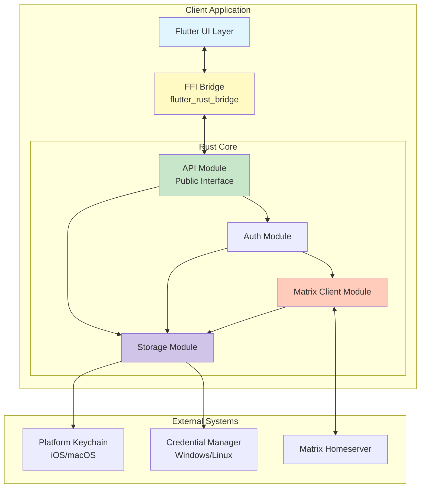
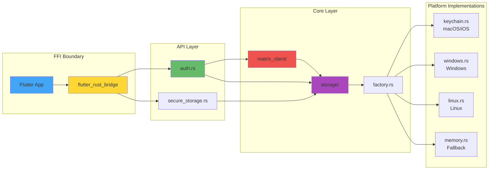
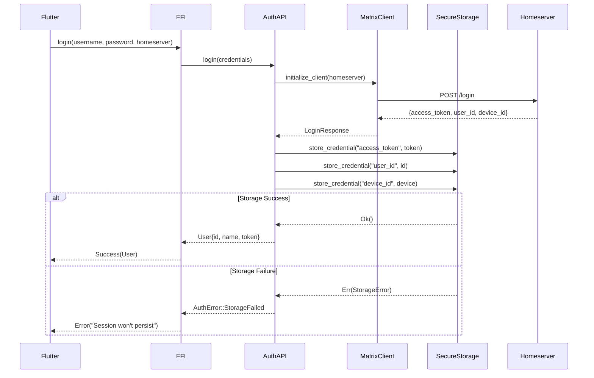
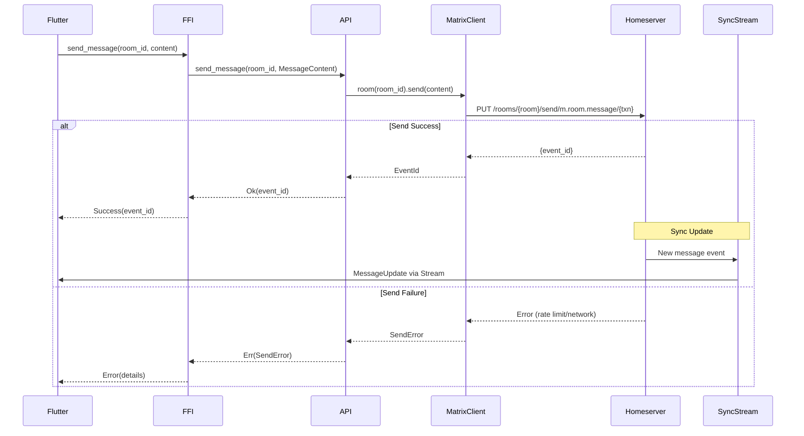
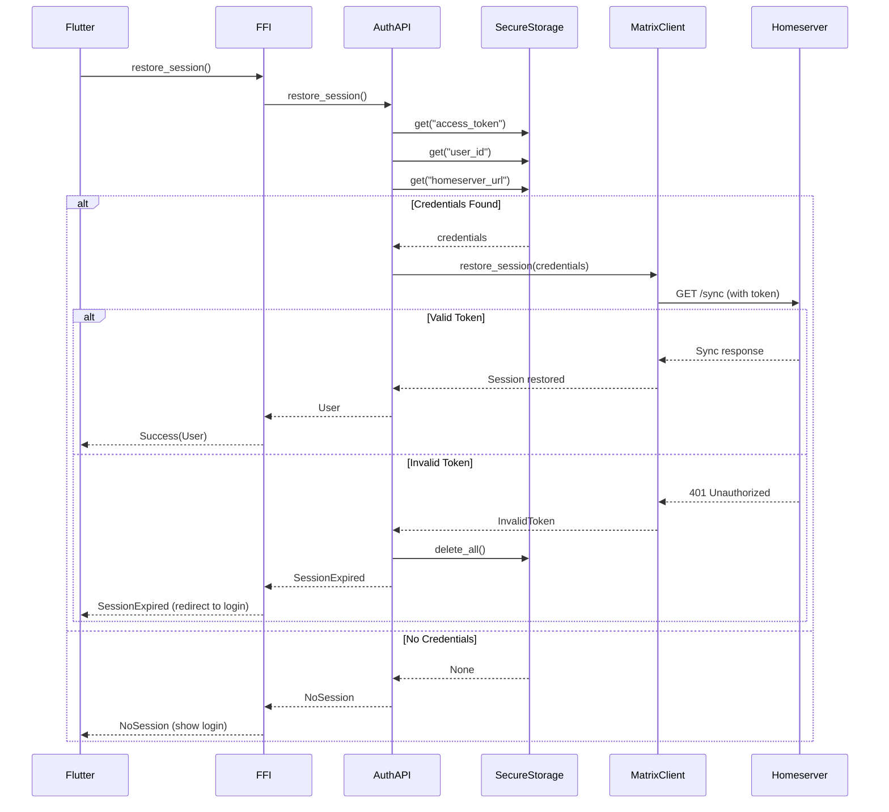

# SkiffyMessenger Rust Backend Architecture Document

## Introduction

This document outlines the overall backend architecture for SkiffyMessenger's Rust core layer, including the Matrix protocol implementation, secure storage systems, FFI bridge design, and cross-platform services. Its primary goal is to serve as the guiding architectural blueprint for AI-driven development, ensuring consistency and adherence to chosen patterns and technologies.

**Relationship to Frontend Architecture:**
The SkiffyMessenger project includes a Flutter-based user interface detailed in the separate Frontend/UI Architecture Documents. This backend architecture document defines the core Rust implementation that powers all business logic, protocol interactions, and data management. Core technology stack choices documented herein are definitive for the backend portion of the project.

### Starter Template or Existing Project

This is an existing project with an established Rust codebase located in the `rust/` directory. The project uses:
- **flutter_rust_bridge** for FFI communication
- **matrix-sdk** for Matrix protocol implementation
- Established module structure with `core` and `api` modules
- Platform-specific secure storage implementations already in place

### Change Log

| Date | Version | Description | Author |
|------|---------|-------------|---------|
| 2025-01-18 | 1.0 | Initial backend architecture document | Winston (Architect) |

## High Level Architecture

### Technical Summary

SkiffyMessenger's Rust backend implements a secure, high-performance messaging core using the Matrix protocol. The architecture follows a modular monolith pattern with clear module boundaries, exposing functionality through a type-safe FFI bridge to the Flutter presentation layer. The system prioritizes security through platform-native credential storage, end-to-end encryption via matrix-sdk, and careful data validation at all boundaries. Core architectural patterns include Repository for data access, Factory for platform-specific implementations, and async/await for non-blocking operations, all orchestrated through the Tokio runtime.

### High Level Overview

1. **Architectural Style**: Modular Monolith with clear module separation
   - Single Rust binary/library with internal module boundaries
   - FFI facade pattern for external communication
   - Platform-specific implementations selected at runtime

2. **Repository Structure**: Monorepo containing both Flutter and Rust code
   - `/rust/` directory for all backend code
   - Shared build tooling and CI/CD pipelines
   - Unified versioning and release process

3. **Service Architecture**: Single service with modular internals
   - Core business logic in `core` module
   - API facade in `api` module
   - Platform abstractions for cross-platform support

4. **Primary Data Flow**:
   - Flutter UI → FFI Bridge → Rust API → Core Logic → Matrix SDK → Matrix Server
   - Responses flow back through the same path
   - Async streams for real-time updates

5. **Key Architectural Decisions**:
   - Matrix-SDK as exclusive protocol implementation (no custom Matrix code)
   - Platform-native security for credential storage
   - Rust for performance-critical operations
   - Thin client pattern keeping UI logic-free

### High Level Project Diagram



### Architectural and Design Patterns

- **Repository Pattern:** Abstract data access logic for storage operations - _Rationale:_ Enables testing with in-memory storage and supports future migration to different storage backends
- **Factory Pattern:** Create platform-specific storage implementations at runtime - _Rationale:_ Allows single codebase to support multiple platforms with native security features
- **Facade Pattern:** Simplified API surface for Flutter consumption - _Rationale:_ Reduces FFI complexity and provides stable interface despite internal changes
- **Async/Await Pattern:** Non-blocking operations throughout the stack - _Rationale:_ Ensures UI remains responsive during network and disk operations
- **Error as Values:** Result<T, E> for all fallible operations - _Rationale:_ Explicit error handling without exceptions, type-safe error propagation
- **Dependency Injection:** Storage implementations injected into services - _Rationale:_ Testability and runtime platform selection
- **Stream Pattern:** Real-time updates via async streams - _Rationale:_ Efficient push-based updates without polling

## Tech Stack

### Cloud Infrastructure

- **Provider:** Self-hosted/Any Matrix homeserver
- **Key Services:** Matrix Synapse/Dendrite/Conduit servers
- **Deployment Regions:** User-configurable homeserver selection

### Technology Stack Table

| Category | Technology | Version | Purpose | Rationale |
|----------|------------|---------|---------|-----------|
| **Language** | Rust | 1.75.0 | Core backend implementation | Memory safety, performance, cross-platform compilation |
| **Runtime** | Tokio | 1.35.0 | Async runtime | Industry standard, excellent performance, mature ecosystem |
| **FFI Bridge** | flutter_rust_bridge | 2.11.1 | Cross-language communication | Type-safe, async support, automatic code generation |
| **Protocol SDK** | matrix-sdk | 0.14.0 | Matrix protocol client | Official SDK, E2EE support, active development |
| **Database** | SQLite/rusqlite | 0.37.0 | Local storage | Embedded, cross-platform, reliable |
| **Crypto** | secp256k1 | 0.26.0 | Cryptographic operations | Required by matrix-sdk, hardware acceleration |
| **Serialization** | serde/serde_json | 1.0 | Data serialization | De-facto standard, efficient, type-safe |
| **Platform Security (macOS/iOS)** | security-framework | 2.9.0 | Keychain access | Native OS integration, secure credential storage |
| **Platform Security (Windows/Linux)** | keyring | 2.0 | Credential storage | Cross-platform abstraction over native stores |
| **Logging** | tracing | 0.1 | Structured logging | Async-aware, hierarchical, performance focused |
| **Error Handling** | anyhow/thiserror | 1.0 | Error management | Type-safe errors with context |
| **Testing** | mockito | 1.0 | HTTP mocking | API testing without external dependencies |
| **UUID Generation** | uuid | 1.3 | Unique identifiers | Standard UUID v4 generation |
| **Date/Time** | chrono | 0.4 | Timestamp handling | Timezone-aware, Matrix timestamp compatibility |
| **Regex** | regex | 1.0 | Pattern matching | Message parsing, validation |

## Data Models

### User

**Purpose:** Represents an authenticated Matrix user account

**Key Attributes:**
- user_id: OwnedUserId - Matrix user identifier (@user:domain.com)
- display_name: Option<String> - User's display name
- avatar_url: Option<String> - Profile picture URL
- device_id: String - Current device identifier
- access_token: String - Authentication token (stored securely)
- refresh_token: Option<String> - Token refresh capability

**Relationships:**
- Has many Rooms (joined/invited)
- Has many Messages (sent)
- Has one Session (active)

### Room

**Purpose:** Represents a Matrix room (chat/channel)

**Key Attributes:**
- room_id: String - Unique room identifier
- name: Option<String> - Room display name
- topic: Option<String> - Room description
- avatar_url: Option<String> - Room avatar
- is_encrypted: bool - E2EE status
- member_count: u32 - Number of participants
- unread_count: u32 - Unread message count
- last_message: Option<Message> - Most recent message

**Relationships:**
- Has many Members (users in room)
- Has many Messages
- Belongs to User (through membership)

### Message

**Purpose:** Represents a single message in a room

**Key Attributes:**
- event_id: String - Unique message identifier
- sender: OwnedUserId - Message author
- room_id: String - Parent room
- content: MessageContent - Message body (text/media/etc)
- timestamp: u64 - Unix timestamp
- edited: bool - Edit status
- reactions: Vec<Reaction> - Message reactions

**Relationships:**
- Belongs to Room
- Belongs to User (sender)
- Has many Reactions

### Session

**Purpose:** Manages active authentication session

**Key Attributes:**
- user_id: OwnedUserId - Authenticated user
- device_id: String - Device identifier
- homeserver_url: String - Matrix server URL
- is_guest: bool - Guest session flag
- sync_token: Option<String> - Incremental sync position

**Relationships:**
- Belongs to User
- Has one active MatrixClient instance

### SecureCredential

**Purpose:** Platform-agnostic secure storage entry

**Key Attributes:**
- key: String - Credential identifier
- value: Vec<u8> - Encrypted credential data
- service: String - Service namespace (skiffy)
- account: String - User account identifier

**Relationships:**
- Managed by SecureStorage trait
- Platform-specific implementation

## Components

### API Module (`/rust/src/api/`)

**Responsibility:** Public interface exposed to Flutter via FFI, handling all cross-language communication and data marshaling

**Key Interfaces:**
- Authentication API (login, logout, session management)
- Room Management API (list, join, create, leave)
- Messaging API (send, edit, delete, react)
- Sync API (real-time updates stream)

**Dependencies:** Core modules, flutter_rust_bridge runtime

**Technology Stack:** Rust async functions, FFI bindings, Result types for error handling

### Core Module (`/rust/src/core/`)

**Responsibility:** Business logic implementation, protocol handling, and core service orchestration

**Key Interfaces:**
- MatrixClient service interface
- Storage abstraction traits
- Event processing pipelines

**Dependencies:** matrix-sdk, storage implementations, platform abstractions

**Technology Stack:** Tokio async runtime, matrix-sdk, trait-based abstractions

### Storage Module (`/rust/src/core/storage/`)

**Responsibility:** Cross-platform secure storage with platform-specific implementations

**Key Interfaces:**
- SecureStorage trait (get, set, delete operations)
- StorageFactory for platform detection
- InMemoryStorage for testing

**Dependencies:** Platform-specific crates (security-framework, keyring)

**Technology Stack:** Platform APIs, trait abstractions, factory pattern

### Matrix Client Module (`/rust/src/core/matrix_client/`)

**Responsibility:** Matrix protocol implementation and server communication

**Key Interfaces:**
- Client initialization and configuration
- Room and message operations
- Sync and event streaming
- E2EE key management

**Dependencies:** matrix-sdk, storage module for credentials

**Technology Stack:** matrix-sdk, async streams, WebSocket connections

### Auth Module (`/rust/src/api/auth.rs`)

**Responsibility:** Authentication flow orchestration and session management

**Key Interfaces:**
- Login methods (password, SSO)
- Session persistence and restoration
- Logout and cleanup

**Dependencies:** Matrix Client, Secure Storage

**Technology Stack:** Async Rust, error handling with custom error types

### Component Diagrams



## External APIs

### Matrix Homeserver API

- **Purpose:** Core messaging protocol and server communication
- **Documentation:** https://spec.matrix.org/latest/client-server-api/
- **Base URL(s):** User-configurable (e.g., https://matrix.org, custom homeservers)
- **Authentication:** Bearer token (access_token header)
- **Rate Limits:** Server-dependent, typically 10-50 requests/second

**Key Endpoints Used:**
- `POST /_matrix/client/v3/login` - User authentication
- `GET /_matrix/client/v3/sync` - Real-time event synchronization
- `PUT /_matrix/client/v3/rooms/{roomId}/send/{eventType}/{txnId}` - Send messages
- `GET /_matrix/client/v3/rooms/{roomId}/messages` - Message history
- `POST /_matrix/client/v3/createRoom` - Create new rooms
- `POST /_matrix/client/v3/logout` - Session termination

**Integration Notes:** All Matrix API calls are handled exclusively through matrix-sdk; no direct HTTP calls should be made to maintain consistency and E2EE support

## Core Workflows

### User Authentication Flow



### Message Sending Flow



### Session Restoration Flow



## REST API Spec

*Note: SkiffyMessenger Rust backend does not expose a REST API. All communication occurs through FFI bridge to Flutter. The Matrix REST API is consumed via matrix-sdk.*

## Database Schema

### SQLite Local Cache Schema

```sql
-- Room metadata cache
CREATE TABLE rooms (
    room_id TEXT PRIMARY KEY,
    name TEXT,
    topic TEXT,
    avatar_url TEXT,
    is_encrypted INTEGER NOT NULL DEFAULT 0,
    member_count INTEGER NOT NULL DEFAULT 0,
    unread_count INTEGER NOT NULL DEFAULT 0,
    last_activity_timestamp INTEGER,
    created_at INTEGER NOT NULL,
    updated_at INTEGER NOT NULL
);

-- Message cache for offline access
CREATE TABLE messages (
    event_id TEXT PRIMARY KEY,
    room_id TEXT NOT NULL,
    sender_id TEXT NOT NULL,
    content TEXT NOT NULL, -- JSON serialized MessageContent
    message_type TEXT NOT NULL,
    timestamp INTEGER NOT NULL,
    edited INTEGER NOT NULL DEFAULT 0,
    deleted INTEGER NOT NULL DEFAULT 0,
    created_at INTEGER NOT NULL,
    FOREIGN KEY (room_id) REFERENCES rooms(room_id) ON DELETE CASCADE
);

-- Reactions storage
CREATE TABLE reactions (
    id INTEGER PRIMARY KEY AUTOINCREMENT,
    event_id TEXT NOT NULL,
    sender_id TEXT NOT NULL,
    reaction TEXT NOT NULL,
    timestamp INTEGER NOT NULL,
    FOREIGN KEY (event_id) REFERENCES messages(event_id) ON DELETE CASCADE,
    UNIQUE(event_id, sender_id, reaction)
);

-- Sync state for incremental updates
CREATE TABLE sync_state (
    id INTEGER PRIMARY KEY CHECK (id = 1), -- Single row
    next_batch TEXT,
    last_sync_timestamp INTEGER,
    filter_id TEXT
);

-- Pending operations queue for offline support
CREATE TABLE pending_operations (
    id INTEGER PRIMARY KEY AUTOINCREMENT,
    operation_type TEXT NOT NULL, -- 'send_message', 'edit_message', etc
    payload TEXT NOT NULL, -- JSON serialized operation data
    retry_count INTEGER NOT NULL DEFAULT 0,
    created_at INTEGER NOT NULL,
    last_retry_at INTEGER
);

-- Indexes for performance
CREATE INDEX idx_messages_room_id ON messages(room_id);
CREATE INDEX idx_messages_timestamp ON messages(room_id, timestamp DESC);
CREATE INDEX idx_reactions_event_id ON reactions(event_id);
CREATE INDEX idx_pending_operations_created ON pending_operations(created_at);
```

### Secure Storage Structure

Platform-specific secure storage uses key-value pairs:

```
Service: "skiffy"
Account: "{user_id}"

Keys:
- "access_token": String - Matrix access token
- "refresh_token": String - Token refresh capability
- "user_id": String - Matrix user identifier
- "device_id": String - Device identifier
- "homeserver_url": String - Matrix server URL
- "encryption_keys": JSON - E2EE key material (via matrix-sdk)
```

## Source Tree

```plaintext
rust/
├── src/
│   ├── lib.rs                     # Main library entry, FFI exports
│   ├── frb_generated.rs           # Auto-generated FFI bindings
│   │
│   ├── api/                       # Public API exposed via FFI
│   │   ├── mod.rs                 # Module exports
│   │   ├── auth.rs                # Authentication endpoints
│   │   └── secure_storage.rs      # Storage API for Flutter
│   │
│   └── core/                      # Core business logic
│       ├── mod.rs                 # Module exports
│       │
│       ├── matrix_client/         # Matrix protocol implementation
│       │   ├── mod.rs             # Client initialization and lifecycle
│       │   ├── structs.rs         # Data structures and types
│       │   ├── unit_tests.rs      # Unit test suite
│       │   └── integration_tests.rs # Integration tests
│       │
│       └── storage/               # Secure storage abstraction
│           ├── mod.rs             # Trait definitions and factory
│           ├── factory.rs         # Platform detection and instantiation
│           ├── keys.rs            # Storage key constants
│           ├── memory.rs          # In-memory implementation
│           ├── keychain.rs        # macOS/iOS Keychain
│           ├── windows.rs         # Windows Credential Manager
│           ├── linux.rs           # Linux Secret Service
│           └── tests.rs           # Storage test suite
│
├── tests/                         # Integration test directory
│   └── integration_test.rs       # Cross-module integration tests
│
├── Cargo.toml                     # Rust dependencies and metadata
├── Cargo.lock                     # Locked dependency versions
├── build.rs                       # Build script (if needed)
└── README.md                      # Rust-specific documentation
```

## Infrastructure and Deployment

### Infrastructure as Code

- **Tool:** Not applicable (client-side application)
- **Location:** N/A
- **Approach:** Build artifacts distributed via app stores

### Deployment Strategy

- **Strategy:** Continuous Integration with release builds
- **CI/CD Platform:** GitHub Actions
- **Pipeline Configuration:** `.github/workflows/rust.yml`

### Environments

- **Development:** Local development with mock Matrix server
- **Staging:** Test homeserver at staging.matrix.org
- **Production:** User-configured Matrix homeserver

### Environment Promotion Flow

```text
Development (Local) -> CI Build -> Release Build -> App Store Review -> Production
                         ↓
                    Beta Testing
```

### Rollback Strategy

- **Primary Method:** Version rollback via app stores
- **Trigger Conditions:** Critical security issues, data corruption bugs
- **Recovery Time Objective:** 24-48 hours (app store review time)

## Error Handling Strategy

### General Approach

- **Error Model:** Result<T, E> with typed errors for each module
- **Exception Hierarchy:** Module-specific error enums with thiserror derives
- **Error Propagation:** Errors bubble up through Result chain, converted at API boundary

### Logging Standards

- **Library:** tracing 0.1
- **Format:** JSON structured logs in production, pretty-printed in development
- **Levels:** ERROR, WARN, INFO, DEBUG, TRACE
- **Required Context:**
  - Correlation ID: UUID per operation
  - Service Context: module::function notation
  - User Context: Hashed user_id (never raw PII)

### Error Handling Patterns

#### External API Errors

- **Retry Policy:** Exponential backoff with max 3 retries
- **Circuit Breaker:** After 5 consecutive failures, pause for 30 seconds
- **Timeout Configuration:** 30s for initial sync, 10s for messages, 60s for media
- **Error Translation:** Matrix errors mapped to user-friendly messages at Flutter layer

#### Business Logic Errors

- **Custom Exceptions:** AuthError, SyncError, StorageError, MessageError enums
- **User-Facing Errors:** Translated in Flutter with localization support
- **Error Codes:** SKIFFY_{MODULE}_{ERROR} format (e.g., SKIFFY_AUTH_INVALID_TOKEN)

#### Data Consistency

- **Transaction Strategy:** SQLite transactions for multi-table updates
- **Compensation Logic:** Rollback local changes on server rejection
- **Idempotency:** Transaction IDs for message sending, operation deduplication

## Coding Standards

### Core Standards

- **Languages & Runtimes:** Rust 1.75.0 (2021 edition)
- **Style & Linting:** rustfmt with default config, clippy with pedantic lints
- **Test Organization:** Unit tests in module files, integration tests in tests/

### Naming Conventions

| Element | Convention | Example |
|---------|------------|---------|
| Modules | snake_case | matrix_client |
| Structs | PascalCase | SecureStorage |
| Functions | snake_case | send_message |
| Constants | UPPER_SNAKE_CASE | MAX_RETRY_COUNT |
| Traits | PascalCase | StorageProvider |

### Critical Rules

- **No unwrap() in production code:** All Results must be properly handled with ? or match
- **No println! in library code:** Use tracing macros exclusively for logging
- **Platform abstractions required:** Never use platform-specific code outside storage module
- **FFI safety:** All FFI-exposed functions must be marked with #[flutter_rust_bridge::frb]
- **Async everywhere:** All I/O operations must be async, no blocking calls
- **Secure by default:** Never log tokens, passwords, or message content
- **Error context:** All errors must include context via anyhow/thiserror

## Test Strategy and Standards

### Testing Philosophy

- **Approach:** Test-driven development where practical
- **Coverage Goals:** 80% line coverage minimum, 100% for security-critical paths
- **Test Pyramid:** 70% unit, 20% integration, 10% end-to-end

### Test Types and Organization

#### Unit Tests

- **Framework:** Built-in Rust test framework
- **File Convention:** Tests in same file as code (#[cfg(test)] module)
- **Location:** Bottom of each source file
- **Mocking Library:** mockito for HTTP, manual mocks for traits
- **Coverage Requirement:** 80% minimum

**AI Agent Requirements:**
- Generate tests for all public methods
- Cover edge cases and error conditions
- Follow AAA pattern (Arrange, Act, Assert)
- Mock all external dependencies

#### Integration Tests

- **Scope:** Cross-module interactions, FFI bridge testing
- **Location:** tests/ directory
- **Test Infrastructure:**
  - **Matrix Server:** Mockito for HTTP mocking
  - **Storage:** InMemoryStorage implementation
  - **Time:** Fixed timestamps for reproducibility

#### End-to-End Tests

- **Framework:** Flutter integration tests calling Rust
- **Scope:** Complete user workflows
- **Environment:** Local Matrix test server (Synapse in Docker)
- **Test Data:** Fixtures in tests/fixtures/

### Test Data Management

- **Strategy:** Builder pattern for test objects
- **Fixtures:** JSON files for complex scenarios
- **Factories:** Test factories for common objects
- **Cleanup:** Automatic cleanup with Drop trait

### Continuous Testing

- **CI Integration:** Tests run on every PR, merge blocks on failure
- **Performance Tests:** Criterion benchmarks for critical paths
- **Security Tests:** cargo-audit on dependencies, fuzzing for parsers

## Security

### Input Validation

- **Validation Library:** Built-in Rust type system, serde validation
- **Validation Location:** At FFI boundary and before Matrix SDK calls
- **Required Rules:**
  - All external inputs MUST be validated
  - Validation at API boundary before processing
  - Whitelist approach preferred over blacklist

### Authentication & Authorization

- **Auth Method:** Matrix access tokens via bearer authentication
- **Session Management:** Tokens stored in platform secure storage
- **Required Patterns:**
  - Token refresh before expiration
  - Automatic session restoration on app start
  - Secure token deletion on logout

### Secrets Management

- **Development:** Environment variables via .env files (never committed)
- **Production:** Platform secure storage (Keychain/Credential Manager)
- **Code Requirements:**
  - NEVER hardcode secrets
  - Access via configuration service only
  - No secrets in logs or error messages

### API Security

- **Rate Limiting:** Respect Matrix server rate limits, local throttling
- **CORS Policy:** Not applicable (native app)
- **Security Headers:** TLS certificate validation for all HTTPS
- **HTTPS Enforcement:** Reject non-HTTPS homeserver URLs

### Data Protection

- **Encryption at Rest:** Platform secure storage for credentials, SQLite encryption for cache
- **Encryption in Transit:** TLS 1.3 minimum for all network communication
- **PII Handling:** Hash user IDs in logs, never store passwords
- **Logging Restrictions:** No message content, no tokens, no personal data

### Dependency Security

- **Scanning Tool:** cargo-audit in CI pipeline
- **Update Policy:** Security updates within 48 hours
- **Approval Process:** New dependencies require security review

### Security Testing

- **SAST Tool:** cargo-clippy with security lints
- **DAST Tool:** Not applicable for client library
- **Penetration Testing:** Annual third-party review

## Checklist Results Report

*Checklist to be executed upon architecture completion*

## Next Steps

### Development Phase

1. **Immediate Actions:**
   - Complete pending Matrix client integration
   - Implement comprehensive error handling
   - Add integration test suite

2. **Backend Enhancements:**
   - Implement offline message queue
   - Add media upload/download handling
   - Optimize sync performance

3. **Security Hardening:**
   - Enable SQLite encryption
   - Implement certificate pinning
   - Add security event logging

### Integration with Frontend

- Backend API is ready for Flutter integration
- FFI bridge provides type-safe communication
- Real-time updates via async streams
- Session management fully implemented

### DevOps Setup

- Configure GitHub Actions for Rust CI/CD
- Set up dependency scanning
- Implement release build automation
- Create distribution packages for each platform